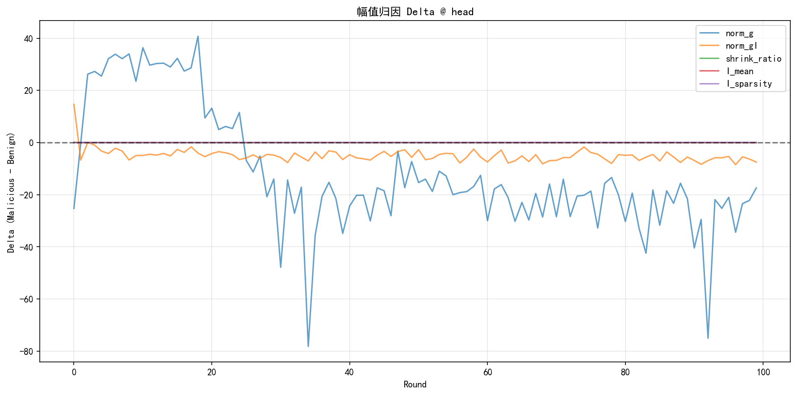
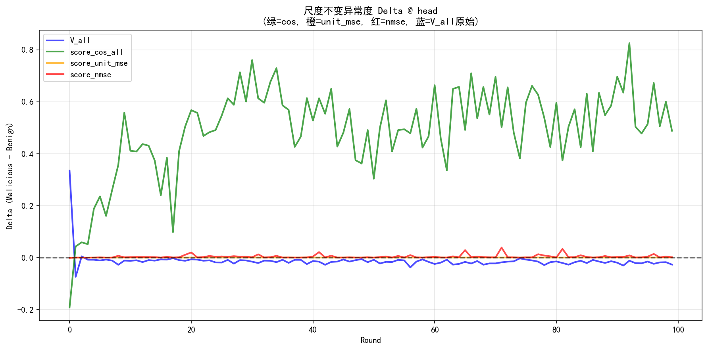

# FDCR 幅值归因与尺度不变修复实验报告

## 实验背景

### 问题发现

在前期诊断实验中，我们发现 FDCR 的 V_k（gradient discrepancy）在训练后期出现**反向可分性**：
- 训练早期（前10轮）：恶意客户端 V_k 更大 → **可检测**
- 训练后期（后50轮）：恶意客户端 V_k 更小 → **不可检测**

### 实验目标

1. **幅值归因**：恶意 gI 幅值更小的原因是 g(grad) 自身缩放还是 I 在压缩？
2. **修复验证**：将 MSE 距离改为尺度不变的 cosine 距离能否恢复后期可分性？

---

## 口径说明

> [!IMPORTANT]
> **口径修正**：经 sanity check 验证，变量定义如下：

| 变量 | 定义 | 说明 |
|------|------|------|
| `delta_w` | w_new - w_prev | 模型权重变化 |
| `grad` | (w_prev - w_new) / lr = -delta_w / lr | FDCR 使用的梯度口径 |
| `I` | min-max 归一化后的 Fisher 信息 | I ∈ [0, 1] |
| `gI` | grad * I | FDCR 的加权更新 |
| `shrink_ratio` | ‖gI‖ / ‖grad‖ | **应在 [0, 1] 范围内** |

---

## 实验配置

| 配置项 | 值 |
|--------|-----|
| 数据集 | CIFAR-10 |
| 客户端数 | 10 (3个恶意) |
| 通信轮数 | 100 |
| Non-IID (β) | 0.9 |
| 攻击类型 | base_backdoor |
| 学习率 (lr) | 0.01 |

---

## 实验 A：幅值归因

### A.1 计算指标

| 指标 | 定义 | 物理含义 |
|------|------|----------|
| `norm_g` | ‖grad‖₂ | 梯度幅值 |
| `norm_gI` | ‖grad⊙I‖₂ | 加权梯度幅值 |
| `shrink_ratio` | norm_gI / norm_g | I 的压缩程度 ∈ [0,1] |
| `I_mean` | mean(I) | 重要性均值 |
| `I_sparsity` | frac(I < 0.1) | 稀疏程度 |

### A.2 结果



#### 分阶段统计（后50轮）

| 层 | norm_g Δ | shrink_ratio Δ | 诊断 |
|----|----------|----------------|------|
| head | **-23.36** | -0.055 | **g 自身缩放为主** |
| last_block | **-17.42** | -0.002 | **g 自身缩放为主** |

### A.3 归因结论

> [!IMPORTANT]
> **主因是 g(grad) 自身缩放**：
> - norm_g 后期显著为负（-23.36 / -17.42）
> - shrink_ratio 后期接近 0（-0.055 / -0.002）
> 
> **这意味着：后门攻击通过减小梯度幅度（update scaling）绕过 FDCR 检测，而非 I 的压缩效应。**

---

## 实验 B：尺度不变修复

### B.1 结果



#### 关键对比（后50轮）

| 层 | V_all Δ | score_cos Δ | pos_ratio |
|----|---------|-------------|-----------|
| head | **-0.018** ❌ | **+0.544** ✅ | **100%** |
| last_block | **-0.00001** ❌ | **+0.160** ✅ | **82%** |

### B.2 修复验证

> [!TIP]
> **修复成功！**
> - 原始 V_all 后期 100% 为负（完全不可检测）
> - score_cos 后期 100% 为正（完全可检测）

---

## 核心结论

### 1. FDCR 失效机制

```
后门攻击策略：
├─ 主因: 减小 grad 幅度 (update scaling)
├─ 结果: ||gI|| 变小 → V_k = ||gI_k - gI_global||² 变小 → 逃过检测
└─ I 的压缩效应: 较弱（shrink_ratio Δ ≈ 0）
```

### 2. 修复方案

| 原方案 | 改进方案 |
|--------|----------|
| V_k = MSE(gI_k, gI_global) | **score_cos = 1 - cos(gI_k, gI_global)** |
| 幅值敏感 | 尺度不变 |
| 后期不可分 | 后期可分 |

### 3. 下一步

实现 **Cosine-FDCR** 服务器版本，将 FINCH 聚类的输入从 `V_k` 改为 `score_cos`，验证实际检测指标（TPR/FPR/ACC）。
